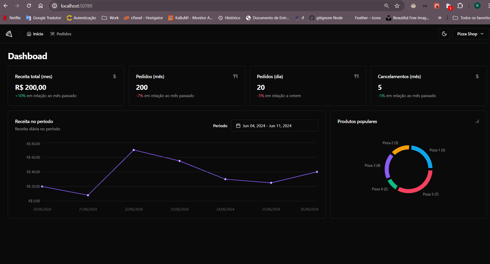
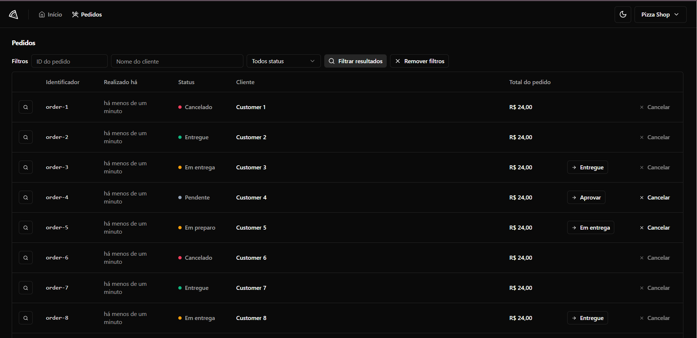
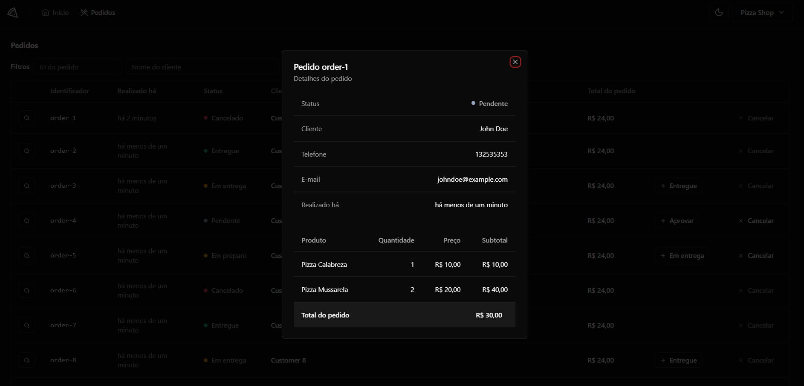
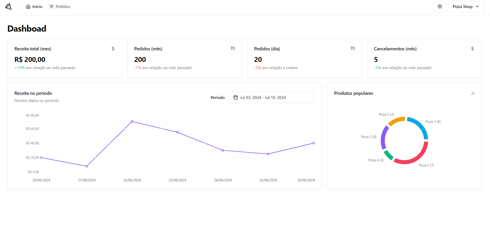
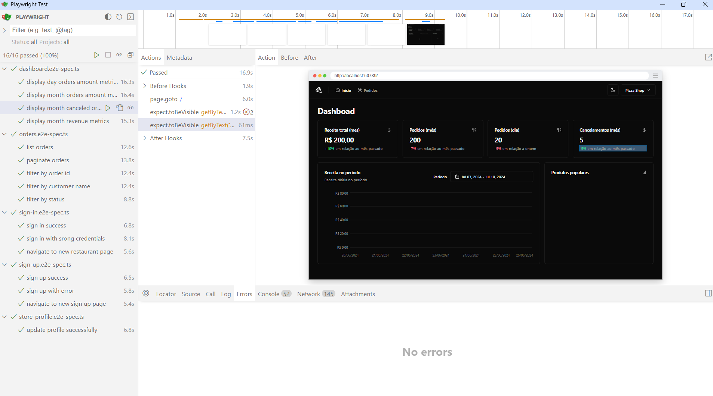

# PizzaShop

## Descrição do Projeto

O projeto consiste em um dashboard para uma pizzaria que opera dentro de um aplicativo de delivery. O objetivo é permitir que o lojista acompanhe diversas métricas do restaurante, como pedidos diários e mensais, utilizando gráficos para visualização.

Além disso, o dashboard permite o acompanhamento detalhado de cada pedido, com informações sobre itens vendidos, a possibilidade de alterar o status dos pedidos e a opção de cancelamento.

O projeto foi desenvolvido com base nas aulas do curso do Ignite utilizando as tecnologias mais modernas.

🚀 Aplicação web PizzaShop

<strong>Dashboard</strong>

<strong>Pedidos</strong>

<strong>Detalhes do pedido</strong>

<strong>Dashboard versão Light</strong>

<strong>Testes e2e utilizando a ferramenta Playwright</strong>
 

### 🛠 Utilizar

Para utilizar localmente:

<ul>
	<li>clonar o repositório do github</li>
	<li>rodar o comando > git clone link-copiado</li>
	<li>rodar o comando > npm install</li>
	

### 🛠 Tecnologias

As seguintes ferramentas foram usadas na construção do projeto:

- [React](https://pt-br.reactjs.org/)
- [TypeScript](https://www.typescriptlang.org/)
- [Shadcn UI](https://ui.shadcn.com/docs)
- [Playwright](https://playwright.dev/docs/intro)

 
  
 <b>Rafael</b></a>

Feito por Rafael Borges 👋🏽 Entre em contato!

 

